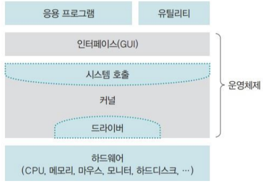

# Chapter.1 : 운영체제 개요
## 목차
1. 운영체제 소개
2. 운영체제 역사
3. 운영체제 구조
___
## 운영체제 소개
### 운영체제 종류
- Windows, Mac OS, Linux, Unix, iOS, Android, Embedded OS
> <b>참고</b>: 임베디드 운영체제는 CPU 성능이 낮고, 메모리 크기가 작은 시스템에 내장된 운영체제를 뜻하며, 이를 보유한 기계는 기능을 계속 향상시킬 수 있다.
### 운영체제 필요성
- 초기의 컴퓨터는 정해진 계산만 수행했기 때문에, 특별한 사용 규칙이 필요하지 않았다.
- 그러나 메모리, CPU 등의 성능이 향상되고, `여러 작업을 동시에 처리`할 수 있는 환경이 조성되면서 `사용 규칙`이 필요해지게 되어 운영체제가 등장하였다.  

    
<b>컴퓨터는 운영체제가 없어도 작동할까?</b>

- 컴퓨터는 운영체제가 없어도 작동하지만, `기능에 제약`이 따른다.
    > <b>참고:</b> 최초의 컴퓨터 <b>에니악</b>은 운영체제가 없었지만, 전선을 교체함으로써 `프로그래밍이 가능`했기 때문에 컴퓨터라고 불린다.     

    
<b>운영체제가 있는 기계와 없는 기계의 차이?</b>

- 운영체제가 있는 기계는 다양한 `응용 프로그램을 설치`할 수 있고, 성능 향상을 위해 `새로운 기능을 추가`할 수 있다.  

    
<b>운영체제는 성능 향상만을 위해 필요할까?</b>

- 운영체제는 `자원을 관리`하고, 사용자에게 편리한 `인터페이스를 제공`한다. 

    
<b>운영체제는 자원을 어떻게 관리할까?</b>

- 운영체제는 `사용자가 직접 자원에 접근하는 것을 막음`으로써 컴퓨터 `자원을 보호`한다. 

    
<b>사용자는 숨어 있는 자원을 어떻게 이용할 수 있을까?</b>

- 운영체제가 제공하는 `사용자 인터페이스`와 `H/W 인터페이스`를 이용하여 `자원에 접근`한다.

### 운영체제 정의
- 운영체제는 사용자에게 편리한 `인터페이스 환경을 제공`하고, 컴퓨터 시스템의 `자원을 효율적으로 관리`하는 `S/W`이다.
### 운영체제 역할
- <b>자원 관리</b>
    - 자원을 요청한 프로그램이 여러 개라면, 적당한 순서로 `자원을 배분`하고, 적절한 시점에 `자원을 회수`하여 다른 응용 프로그램에 나누어준다.
- <b>자원 보호</b>
    - 어떤 응용 프로그램이 남의 `영역`을 침범하지 못하도록 자원에 대한 `직접적인 접근을 방지`한다.
- <b>H/W 인터페이스 제공</b>
    - `다양한 H/W 장치`를 복잡한 과정 없이 사용할 수 있도록 `H/W 인터페이스를 제공`한다.
- <b>사용자 인터페이스 제공</b>
    - `GUI`와 같이, 사용자가 운영체제를 편리하게 사용할 수 있도록 `사용자 인터페이스를 제공`한다.
### 운영체제 목표
- <b>효율성</b>
    - 같은 자원을 사용하여 `더 많은 작업량을 처리`하거나, 같은 작업량을 처리하는 데 `보다 적은 자원을 사용`해야 한다.
- <b>안정성</b>
    - `사용자와 응용 프로그램의 안전 문제`와 `H/W적인 보안 문제`를 처리할 수 있어야 하며, 시스템에 문제가 발생했을 때 이전으로 복구하는 `결함 포용 기능`을 수행해야 한다.
- <b>확장성</b>
    - 운영체제는 다양한 시스템 `자원을 추가하거나 제거`하기가 `편리`해야 한다.
    - H/W의 종류에 상관없이 꽂으면 바로 실행할 수 있는 `plug & play` 기능을 제공해야 한다.
    - 앞으로 개발될 H/W도 제약 없이 사용할 수 있도록 `H/W 제작자의 편리성`도 고려해야 한다.
- <b>편리성</b>
    - 응용 프로그램과 사용자에게 다양한 `편리성을 제공`하면서 자원의 낭비 요소를 막아야 한다.
## 운영체제 역사
### 개요
<table>
<tr>
    <th>구분</th>
    <th>시기</th>
    <th>주요 기술</th>
    <th>특징</th>
</tr>
<tr>
    <td>0기</td>
    <td>1940년대</td>
    <td>없음</td>
    <td>- 진공관(0과 1) 사용 - 하드와이어링 방식</td>
</tr>
<tr>
    <td>1기</td>
    <td>1950년대</td>
    <td>카드 리더, 라인 프린터</td>
    <td>- 일괄 작업 시스템 - 운영체제 등장 - IC칩 방식</td>
</tr>
<tr>
    <td>2기</td>
    <td>1960년대 초반</td>
    <td>키보드, 모니터</td>
    <td>- 대화형 시스템</td>
</tr>
<tr>
    <td>3기</td>
    <td>1960년대 후반</td>
    <td>C언어</td>
    <td>- 다중 프로그래밍 기술개발 - 시분할 시스템</td>
</tr>
<tr>
    <td>4기</td>
    <td>1970년대</td>
    <td>PC</td>
    <td>- 개인용 컴퓨터 등장 - 분산 시스템</td>
</tr>
<tr>
    <td>5기</td>
    <td>1990년대</td>
    <td>웹</td>
    <td>- 클라이언트/서버 시스템</td>
</tr>
<tr>
    <td>6기</td>
    <td>2000년대</td>
    <td>스마트폰</td>
    <td>- P2P 시스템(메신저, 파일 공유) - 그리드 컴퓨팅 - 클라우드 컴퓨팅 - 사물 인터넷</td>
</tr>
</table>

### 초창기 컴퓨터(1940년대)
- 최초의 컴퓨터 `에니악`
    - 진공관 소자 사용, 켜지면 1, 꺼지면 0
    - 전선을 연결하여 논리회로를 구성(`하드와이어링`)
    - 운영체제 X
    - 다른 계산, 수식 사용하려면 전선을 다시 연결해야 했음
### 일괄 작업 시스템(1950년대)
- 진공관과 전선으로 만들어진 논리회로를 아주 작은 크기로 구현한 `IC칩`으로 컴퓨터를 구성
- `CPU, 메인 메모리, 운영체제 O`
- 입출력 장치 존재
    - `천공카드 리더`: 구멍을 뚫어 문자나 숫자를 입력
    - `라인 프린터`: 한 번에 한 줄씩 문자를 출력
- 다른 작업을 하려면, 전선을 다시 연결할 필요 없이 `프로그램만 바꾸면 가능`
- `한 번에 한 가지 작업만` 가능
### 대화형 시스템(1960년대 초)
- 키보드, 모니터 등장
- `작업 중간에 입출력`이 가능해졌으며, 작업의 흐름 제어 가능
- 다양한 종류의 응용 프로그램을 만들 수 있게 됨
- 작업 시간 예측이 힘듦
> <b>참고</b>
> - <b>CPU 집중 작업</b>
>   - 일괄 작업 시스템에서는 프로그램이 실행되는 동안 입출력이 불가능하기 때문에, 대부분의 작업이 CPU만 사용하는 계산 작업이었다.
> - <b>입출력 집중 작업</b>
>   - 대화형 시스템에서는 프로그램 실행 중 입출력이 가능하기 때문에, 대부분의 작업 시간을 주변장치의 입출력에 사용할 수 있었다.
### 시분할 시스템(1960년대 말)
- 하나의 CPU로 여러 작업을 동시에 실행하는 `다중 프로그래밍(multiprogramming)` 기술이 개발됨.
    - CPU 사용 시간을 아주 잘게 쪼개어(time quantum) 여러 작업에 나누어주어 동시에 처리되는 것 처럼 보이게 하는 기술
- 여러 작업을 동시에 처리하기 위한 `추가 작업`이 필요하다는 단점 존재
- 많은 양의 작업이 공존할 경우, 중요한 작업이 일정 시간 안에 끝나는 것을 보장 X
    - 특정 시스템에서 일정 시간 안에 작업이 처리되도록 보장하는 `실시간 시스템(real-time system)`을 사용함.
        > <b>참고</b>
        > - <b>경성(hard) 실시간 시스템</b>
        >   - 지정한 응답 시간을 정확히 지키는 시스템. (원자로 온도 제어, 미사일 요격 등)
        > - <b>연성(soft) 실시간 시스템</b>
        >   - 지정한 응답 시간을 최대한 지키지만, 융통성이 허용된 시스템 (동영상 재생기 등)
- 시분할 시스템 덕분에 하나의 컴퓨터에서 여러 명이 작업할 수 있는 `다중 사용자 시스템(multi-user system)`이 가능했다.
- AT&T 벨 연구소에서 C언어로 `유닉스` 개발
### 분산 시스템(1970년대 말)
- 최초 개인용 컴퓨터 애플II 탄생
    - 개인용 컴퓨터의 운영체제로 MS-DOS 사용
- 인터넷의 등장
- 값이 싸고 크기가 작은 컴퓨터들을 하나로 묶어 대형 컴퓨터에 버금가는 시스템인 `분산 시스템`의 탄생
    - 네트워크상에 분산되어 있는 여러 컴퓨터로 작업을 처리하고, 그 결과를 상호 교환하도록 구성한 시스템
### 클라이언트/서버 시스템(1990년대~현재)
- 분산 시스템은 모든 컴퓨터가 동일한 지위 -> 컴퓨터 고장or추가 시, 작업 분배와 결과를 모으는 것의 어려움 존재.
- 작업을 요청하는 클라이언트, 응답하여 요청받은 작업을 처리하는 서버의 이중 구조인 `클라이언트/서버 시스템`의 탄생
- `웹 시스템`이 보급되면서 인터넷을 사용하는 일반인이 급속도로 증가.
- 단점: `서버 과부하`
> <b>참고</b>
> - <b>데몬</b>
>   - 서버가 멈추지 않고 계속 작동하는 프로그램.
>   - 웹 데몬의 역할을 하는 프로그램으로는 `아파치 톰캣`이 있다.
### P2P 시스템(2000년대~현재)
- 서버의 부하를 줄일 수 있는 `P2P 시스템`의 등장
    - 서버를 거치지 않고, 사용자와 사용자를 직접 연결(peer to peer)
    - 서버가 파일 검색만 맡고, 사용자 간에 파일 전송이 이루어짐
    > ex) 메신저, 토렌트 파일공유 등
### 기타 컴퓨팅 환경(2000년대~현재)
- <b>그리드 컴퓨팅</b>
    - 분산 시스템의 한 분야로, 여러 컴퓨터들을 묶어 대용량의 컴퓨터 풀을 구성하고, 이를 원격지와 연결하여 대용량 연산을 수행하는 컴퓨팅 환경
    - <b>그리드 딜리버리</b>
        - 웹 하드에서 어떤 파일을 내려받은 컴퓨터로부터 몰래 데이터를 빼와서 전달함으로써 서버의 부하를 줄이는 방식
    - <b>SaaS</b>(Software As A Service)
        - 사용자가 필요할 때 소프트웨어 기능을 이용하고, 그만큼만 비용을 지불하는 개념
- <b>클라우드 컴퓨팅</b>
    - 언제 어디서나 응용 프로그램과 데이터를 자유롭게 사용할 수 있는 컴퓨팅 환경
    - `그리드 컴퓨팅 + SaaS 형태`
    - 기기 간의 데이터 이동이 자유로운 컴퓨팅 환경
    - IT 산업 전반에 많이 이용됨
        > ex) 
        > - 클라우드 서버에 회사 홈페이지를 올려놓고 사용한 만큼 비용 지불.
        > - 서버 관리와 네트워크 관리를 클라우드 서버 제공자가 알아서 해주므로 편리하다.
- <b>사물 인터넷(IoT)</b>
    - 사물에 센서와 통신 기능을 내장하여 인터넷에 연결하는 기술
## 운영체제 구조
### 커널과 인터페이스
- <b>커널</b>
    - 운영체제의 핵심 기능을 모아놓은 S/W
    - 프로세스 관리, 메모리 관리, 파일 시스템 관리, 입출력 관리, 프로세스 간 통신 관리 등을 수행
    - 운영체제의 성능은 커널이 좌우
<table>
<tr>
<th>핵심 기능</th>
<th>설명</th>
</tr>
<tr>
<td>프로세스 관리</td>
<td>프로세스에 CPU를 배분하고, 작업에 필요한 제반 환경을 제공</td>
</tr>
<tr>
<td>메모리 관리</td>
<td>프로세스에 작업 공간을 배치하고, 실제 메모리보다 큰 가상공간을 제공</td>
</tr>
<tr>
<td>파일 시스템 관리</td>
<td>데이터를 저장하고, 접근할 수 있는 인터페이스 제공</td>
</tr>
<tr>
<td>입출력 관리</td>
<td>필요한 입력과 출력 서비스를 제공</td>
</tr>
<tr>
<td>프로세스 간 통신 관리</td>
<td>공동 작업을 위한 각 프로세스 간 통신 환경을 지원한다.</td>
</tr>
</table>

- <b>컴퓨터 시스템의 구조</b>
    - 
    - 운영체제는 크게 두 부분으로 나뉜다.
        1. 사용자와 응용 프로그램에 인접하여, 커널에 명령을 전달하고, 실행 결과를 사용자와 응용 프로그램에 돌려주는 인터페이스
        2. 운영체제의 핵심 기능을 모아놓은 커널
    - 운영체제는 커널과 인터페이스를 분리하여, 같은 커널을 사용하더라도 다른 인터페이스를 가진 형태로 제작할 수 있다.
        > ex) <b>유닉스</b>
        > - 사용자 인터페이스: 쉘
        > - C쉘, T쉘, Bash쉘
### 시스템 호출과 디바이스 드라이버
- <b>시스템 호출</b>
    - 커널이 제공하는 시스템 자원의 사용과 연관된 함수이다.
    - 응용 프로그램이 `H/W 자원에 접근`하거나, `운영체제가 제공하는 서비스`를 이용하려 할 때는 반드시 시스템 호출을 사용해야 한다.
    - 운영체제는 `커널이 제공하는 서비스에 대한 접근을 시스템 호출로 제한`하여 컴퓨터 자원을 보호한다.
    - 커널이 제공하는 서비스를 이용하기 위한 인터페이스이며, 사용자가 자발적으로 커널 영역에 진입할 수 있는 `유일한 수단`이다.
> ex)
> - write(), read(), printf(), ...
> - printf() 함수를 사용하면, 화면의 문자와 겹치는 부분 없이 문자를 쉽게 화면에 출력할 수 있다.

> <B>참고</B>
> - <b>API</b> (Application Programming Interface)
>   - 응용 프로그램이 자신과 연관된 프로그램을 만들 수 있도록 제공하는 인터페이스
>   - 운영체제의 API를 시스템 호출이라 정의할 수 있음
> - <b>SDK</b> (System Developer's Kit)
>   - 프로그램 개발자를 위해 API, 코드 편집기, 에뮬레이터 등 개발용 응용 프로그램까지 하나로 묶어 배포하는 개발 툴
>   - 대표적인 예로 안드로이드 SDK인 Android Studio가 있다
- <b>드라이버</b>
    - 응용 프로그램과 커널의 인터페이스가 시스템 호출이라면, `커널과 H/W의 인터페이스는 드라이버가 담당`한다.
    - 커널은 입출력의 기본적인 부분의 드라이버만 제작하고, H/W의 특성을 반영한 S/W를 H/W 제작자에게 받아 커널이 실행될 때 함께 실행되도록 한다.
    - <b>디바이스 드라이버</b>
        - H/W 제작자가 만든 S/W
        - H/W 특성은 제작자가 가장 잘 알고 있기 때문에, 제작자가 관련 S/W를 만드는 것이 유리하다.
### 커널의 구성
- <b>단일형 구조 커널</b> (monolithic architecture kernel)
    - 초창기 운영체제 구조로, `커널의 핵심 기능을 구현하는 모듈들`이 구분 없이 `하나로 구성`되어 있다.
    > ex) MS-DOS, VMS, 초기 Unix
    - 장점
        1. 모듈이 거의 분리되지 않았기 때문에, `모듈 간 통신 비용이 줄어`들어 효율적인 운영이 가능
    - 단점
        1. 모든 모듈이 하나로 묶여 있기 때문에, `버그나 오류를 처리하기 어렵다`.
        2. 운영체제의 여러 기능이 서로 연결되어 `상호 의존성이 높아` 기능상의 `작은 결함이 시스템 전체로 확산`될 수 있다.
        3. 수정이 어려워 `이식성이 낮다`.
- <b>계층형 구조 커널</b> (layered architecture kernel)
    - `비슷한 기능을 가진 모듈을 묶어 하나의 계층`으로 만들어 `계층 간의 통신`을 통해 운영체제를 구현하는 방식
    - 장점
        1. 모듈화했기 때문에, `버그나 오류를 쉽게 처리`할 수 있다.
        2. 오류가 발생했을 때, `해당 계층만 따로 수정`하면 되므로 `디버깅 하기도 쉽다`.
    - 오늘날의 대부분 운영체제는 이 구조로 이루어져 있다.
- <b>마이크로 구조 커널</b> (micro architecture kernel)
    - `프로세스 관리, 메모리 관리, 프로세스 간 통신 관리` 등 가장 `기본적인 기능만 제공`
    - 운영체제의 많은 부분이 `사용자 영역`에 구현되어 있음
    - `각 모듈은 세분화`되어 존재하며, 모듈 간 정보 교환은 `프로세스 간 통신`을 이용하여 이루어짐
    - `이식성이 좋고 커널이 가벼워` CPU 용량이 작은 시스템에도 적용이 가능
    > ex) 대표적인 운영체제 마하(Mach)는 OS X, iOS의 커널로 사용됨
### 가상머신
- 운영체제와 응용 프로그램 사이에서 작동하는 프로그램
- 가상머신을 사용하면, 응용 프로그램이 모두 `동일한 환경에서 작동하는 것`처럼 보인다.
- 가상머신을 사용하면 `호환성이 높아`지지만, 응용 프로그램이 `느려`진다는 단점도 있다.
> ex) JVM, Vmware