# Chapter.2 : 컴퓨터의 구조와 성능 향상
## 목차
1. 컴퓨터의 기본 구성
2. CPU와 메모리
3. 컴퓨터 성능 향상 기술
4. 병렬 처리
___
## 컴퓨터의 기본 구성
### 1. 하드웨어의 구성
- 컴퓨터는 `중앙처리장치(CPU)`, `메인메모리`, `입출력장치`, `저장장치`로 구성된다.
    - CPU와 메인메모리는 `필수 장치`로 분류된다.
    - 메인메모리를 `제1저장장치`, 하드디스크나 USB 메모리 등을 `제2저장장치` 또는 `보조저장장치`라 부른다.
#### 1.1 CPU와 메모리
- <b>CPU</b>
    - `명령어를 해석`하여 `실행`하는 장치
- <b>메모리</b>
    - 작업에 필요한 `프로그램과 데이터를 저장`하는 장소
    - `바이트 단위로 분할`되어 있으며, `분할 공간마다 주소로 구분`
#### 1.2 입출력장치
- <b>입력장치</b>
    - 외부의 데이터를 컴퓨터에 입력하는 장치
    > ex) 천공카드, 키보드, 마우스, 스캐너, 터치스크린 등
- <b>출력장치</b>
    - 컴퓨터에서 처리한 결과를 사용자가 원하는 형태로 출력하는 장치
    > ex) 프린터, 모니터, 스피커 등
    > - 모니터는 그래픽카드와 연결, 스피커는 사운드카드와 연결
#### 1.3 저장장치
- <b>메모리</b>
    - `전자의 이동`으로 데이터를 처리
- <b>저장장치</b>
    - 느리지만 저렴하며 용량이 크고, 데이터를 영구적으로 저장
    - <b>분류</b>
        1. `자성`을 이용하는 장치
            > ex) 카세트테이프, 플로피디스크, 하드디스크 등
        2. `레이저`를 이용하는 장치
            > ex) CD, DVD, 블루레이디스크 등
        3. `메모리`를 이용하는 장치
            > ex) USB 드라이버, SD 카드, CF 카드, SSD 등
#### 1.4 메인보드
- <b>버스</b>
    - 일정한 규칙에 따라 각 장치에 데이터를 전송하는 역할
- <b>메인보드</b> 
    - 컴퓨터의 다양한 부품을 버스로 연결한 커다란 판
### 2. 폰노이만 구조
- <b>폰노이만 구조</b>
    - CPU, 메모리, 입출력장치, 저장장치가 `버스로 연결`되어 있는 구조
    - H/W는 그대로 둔 채, `프로그램만 교체하여 메모리에 올리는 방식`
### 2.1 H/W 사양 관련 용어
- <b>클록(clock)</b>
    - `CPU의 속도`와 관련된 단위
    - 일정 간격으로 `틱(tick)`을 만들고, 여기에 맞추어 CPU 구성 부품들이 작업을 한다.
    - 메인보드의 클록이 틱을 보낼 때마다 데이터를 보내거나 받는다.
- <b>헤르츠(Hz)</b>
    - `클록틱이 발생하는 속도`를 나타내는 단위이다.
    - 1초에 클록틱이 몇 번 발생하는지를 나타낸다.
- <b>시스템 버스(System bus)</b>
    - `메모리와 주변장치를 연결`하는 버스로 `FSB(Front-Side Bus), 전면 버스`라고 부른다.
    - 메인보드 속도보다 낮은 속도의 메모리를 사용하면 그만큼 컴퓨터의 성능이 저하된다.
- <b>CPU 내부 버스</b>
    - `CPU 내부에 있는 장치를 연결`하는 버스로, `BSB(Back-Side Bus), 후면 버스`라고 부른다.
    - `CPU 클록과 속도가 같아` 시스템 버스보다 훨씬 빠르다.<br><br>
- 두 버스의 속도 차이로 인해 작업이 지연되는 문제가 발생한다.
> <b>기억 용량 단위</b>(참고)
> - 1B: 1 byte
> - 1KB: 2¹⁰ byte ≒ 10³ byte
> - 1MB: 2²⁰ byte ≒ 10⁶ byte
> - 1GB: 2³⁰ byte ≒ 10⁹ byte
> - 1TB: 2⁴⁰ byte ≒ 10¹² byte
___
## CPU와 메모리
### 1. CPU의 구성과 동작
#### 1.1 CPU의 기본 구성
- <B>CPU</B>
    - CPU는 `산술논리 연산장치`, `제어장치`, `레지스터`로 구성되며, 이것들의 `협업`으로 작업을 처리한다.
- <b>산술논리 연산장치(Arithmetic and Logic Unit, ALU)</b>
    - CPU에서 데이터를 연산하는 장치이며 `산술 연산`과 `논리 연산`을 수행한다.
- <b>제어장치(Control Unit)</b>
    - CPU에서 `작업을 지시`하는 장치이다.
- <b>레지스터(Register)</b>
    - CPU 내에 `데이터를 임시로 보관`하는 장소이다.
#### 1.2 CPU의 명령어 처리 과정
- <b>C 언어로 작성한 덧셈 프로그램</b>
    ```c++
    int D2 = 2, D3 = 3, sum;
    sum = D2 + D3;
    ```
- <b>어셈블리어로 변환한 덧셈 프로그램</b>
    ```c++
    LOAD mem(100), register 2; // 100번지(D2) 메모리에 있는 값을 레지스터 2로 가져온다
    LOAD mem(120), register 3; // 120번지(D3) 메모리에 있는 값을 레지스터 3으로 가져온다
    ADD register 5, register 2, register 3; // 레지스터 2와 3에 저장된 값을 더한 결과를 레지스터 5에 넣는다
    MOVE register 5, mem(160); // 레지스터 5의 값을 160번지(sum) 메모리로 옮긴다
    ```
- 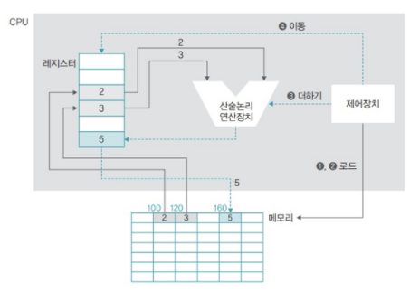
    - CPU가 연산을 하려면 필요한 데이터를 CPU로 가져와 임시로 보관해야 하는데, 이 때 사용되는 장소가 `레지스터`이다.
#### 1.3 레지스터의 종류
- <b>CPU는 필요한 데이터를 메모리에서 가져와 레지스터에 저장하고, 산술논리 연산장치를 이용하여 연산을 한 후, 그 결과를 다시 레지스터에 저장했다가 메모리로 옮긴다.</b>
    - 이 때 사용되는 레지스터는 `데이터 레지스터`와 `주소 레지스터`이다.
    - 두 레지스터는 사용자 프로그램에 의해 변경되기 때문에 `사용자 가시 레지스터(user-visible register)`라고 부른다
        - <b>데이터 레지스터(DR)</b>
            - 메모리에서 가져온 데이터를 임시로 보관할 때 사용한다.
            - CPU에 있는 대부분의 레지스터가 데이터 레지스터이기 때문에 `일반 레지스터` 또는 `범용 레지스터`라고 부른다.
        - <b>주소 레지스터(AR)</b>
            - 데이터 또는 명령어가 저장된 메모리의 주소를 저장한다.
    - 이외에도 특별한 용도로 사용되는 `특수 레지스터`가 존재한다.
    - 사용자가 임의로 변경할 수 없기 때문에 `사용자 불가시 레지스터(user-invisible register)`라고 부른다.
        - <b>프로그램 카운터(PC)</b>
            - CPU는 다음에 어떤 명령어를 처리해야 할 지 알아야 한다.
            - 프로그램 카운터는 `다음에 실행할 명령어의 주소`를 기억하고 있다가 `제어장치에 알려준다`.
            - 다음에 실행할 명령어의 주소를 가리키기 때문에, `명령어 포인터`라고도 부른다.
        - <b>명령어 레지스터(IR)</b>
            - `현재 실행중인 명령어를 저장`한다.
            - `제어장치`는 명령어 레지스터에 있는 `명령을 해석`한 후 외부 장치에 적절한 `제어 신호를 보낸다`.
        - <b>메모리 주소 레지스터(MAR)</b>
            - 메모리에서 데이터를 가져오거나, 메모리로 데이터를 보낼 때 `주소를 지정`하기 위해 사용한다.
            - `메모리 관리자`가 이를 인식하여 해당 데이터를 가져오거나 저장한다.
        - <b>메모리 버퍼 레지스터(MBR)</b>
            - 메모리에서 가져오거나, 메모리로 옮겨 갈 `데이터를 임시로 저장`한다.
            - 항상 `메모리 주소 레지스터와 함께 동작`한다.
    - `LOAD mem(100), register 2`의 실행 과정
        - 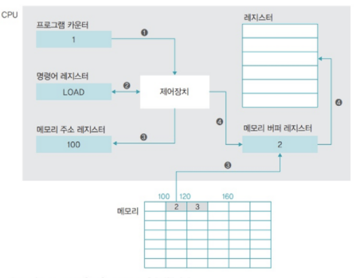
            1. `프로그램 카운터`에는 현재 실행 중인 코드의 행 번호 1이 저장되고, 이 번호는 제어장치에 전송된다. `명령어 레지스터`에는 LOAD가 탑재된다.
            2. `제어장치`가 `명령어 레지스터`에 있는 명령을 해석하여 메모리에 있는 데이터를 가져오라는 제어 신호를 보낸다.
            3. `메모리 주소 레지스터`에는 100이 저장되고, `메모리 관리자`는 메모리의 100번지에 저장된 값을 `메모리 버퍼 레지스터`로 가져온다.
            4. `제어장치`는 `메모리 버퍼 레지스터`에 저장된 값을 레지스터 2로 옮긴다.
    - 이외에도 CPU가 사용하는 레지스터는 아주 많다.
        - <b>프로그램 상태 레지스터(Program Status Register, PSR)</b>
            - `산술논리 연산장치와 연결`되어 있으며, `연산 결과`(양수, 음수, 0, 자리 올림 유무 등)를 저장한다.
            - `플래그 레지스터`, `상태 레지스터`, `컨디션 레지스터`라고도 부른다.
- 주요 레지스터의 종류와 특징

    <table>
    <tr>
    <th colspan="2">레지스터</th>
    <th>특징</th>
    </tr>
    <tr>
    <td rowspan="2">사용자 가시 레지스터</td>
    <td>데이터 레지스터(DR)</td>
    <td>CPU가 명령어를 처리하는 데 필요한 <b>일반 데이터를 임시로 저장</b>하는 범용 레지스터</td>
    </tr>
    <tr>
    <td>주소 레지스터(AR)</td>
    <td>데이터 또는 명령어가 저장된 <b>메모리의 주소</b>를 저장</td>
    </tr>
    <tr>
    <td rowspan="5">사용자 불가시 레지스터</td>
    <td>프로그램 카운터(PC)</td>
    <td><b>다음에 실행할 명령어의 위치정보</b>(코드의 행 번호, 메모리 주소)를 저장</td>
    </tr>
    <tr>
    <td>명령어 레지스터(IR)</td>
    <td><b>현재 실행중인 명령어</b>를 저장</td>
    </tr>
    <tr>
    <td>메모리 주소 레지스터(MAR)</td>
    <td>메모리 관리자가 접근해야 할 <b>메모리의 주소</b>를 저장</td>
    </tr>
    <tr>
    <td>메모리 버퍼 레지스터(MBR)</td>
    <td>메모리 관리자가 메모리에서 가져온 <b>데이터를 임시로 저장</b></td>
    </tr>
    <tr>
    <td>프로그램 상태 레지스터(PSR)</td>
    <td><b>연산 결과</b>(양수, 음수 등)를 저장</td>
    </tr>
    </table>
#### 1.4 버스의 종류
- <b>버스</b>
    - 버스는 CPU와 메모리, 주변장치 간 데이터를 주고받을 때 사용한다.
- <b>버스의 종류와 구조</b>
    - 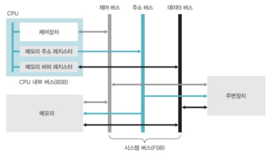
        - <b>제어 버스</b>
            - 다음에 어떤 작업을 할지 `지시하는 제어 신호`가 오고 간다.
                > ex)
                > - 메모리에서 데이터를 가져오라는 지시 정보(읽기 신호)
                > - 처리한 데이터를 옮겨놓으라는 지시 정보(쓰기 신호)
                > - 하드디스크에 저장 명령
                > - 사운드카드에 소리를 내라는 명령
                > - 메모리에서 오류 발생, 주변장치에 데이터가 도착했다는 신호 등
            - 제어 신호는 CPU, 메모리, 주변장치와 `양방향`으로 오고 간다.
        - <b>주소 버스</b>
            - 메모리(주변장치)의 데이터를 읽거나 쓸 때 어느 위치에서 작업할 것인지를 알려주는 `위치 정보`가 오고 간다.
            - `메모리 주소 레지스터와 연결`되어 있으며, `단방향`이다.
        - <b>데이터 버스</b>
            - 제어 버스가 신호를 보내고, 주소 버스가 위치 정보를 전달하면, 데이터가 데이터 버스에 실려 목적지까지 이동한다.
            - `메모리 버퍼 레지스터와 연결`되어 있으며, `양방향`이다.
    - <b>대역폭(bandwidth)</b>
        - `한 번에 전달할 수 있는 데이터의 최대 크기`이며, 아래와 동일하다.
            - `CPU가 한 번에 처리할 수 있는 데이터의 크기`
            - `레지스터의 크기`
            - `메모리에 한 번에 저장할 수 있는 데이터의 크기`
        - 위의 모든 단위는 `워드(word)`라고 한다.
            > ex) 32bit CPU에서 1워드는 32bit이다.
### 2. 메모리의 종류와 부팅
- 메모리를 이루는 소자 하나의 크기는 1bit로 0 또는 1이 저장된다.
- 그러나 소자 하나만으로 데이터를 표현할 수는 없으므로, 메모리 주소는 `바이트 단위`로 지정되고, 메모리에서 데이터를 읽거나 쓸 때는 `워드 단위`로 움직인다.
#### 2.1 메모리의 종류
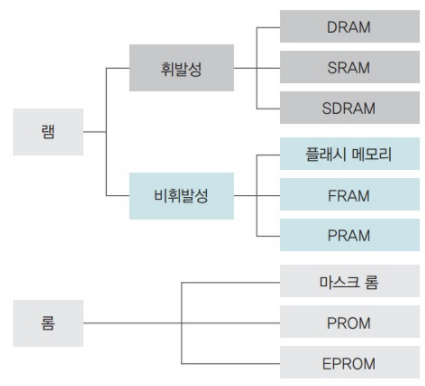
- <b>램(RAM, Random Acces Memory)</b>
    - 읽거나 쓸 수 있는 메모리
    - 무작위로 데이터를 읽어도 저장된 위치와 상관없이 항상 `같은 속도`로 데이터를 읽을 수 있음
    - 전력이 끊기면 데이터가 사라지는 `휘발성 메모리`와 그렇지 않은 `비휘발성 메모리`로 나뉜다.<br><br>
    - <b>휘발성 메모리(volatility memory)</b>
        - <b>DRAM(Dynamic RAM)</b>
            - 저장된 데이터가 일정 시간이 지나면 사라지므로, `일정 시간마다 다시 재생`시켜야 함
        - <b>SRAM(Static RAM)</b>
            - 전력이 공급되는 동안 데이터를 보관할 수 있어 `재생할 필요가 없음`
        - <b>SDRAM(Synchronous Dynamic RAM)</b>
            - `클록틱이 발생`할 때마다 `데이터를 저장`하는 동기 DRAM이다.
        - <b>DDR SDRAM(Double Date Rate SDRAM)</b>
            - BSB와 FSB의 속도 차이를 완화하기 위해, SDRAM의 `대역폭을 늘려 데이터 입출력 속도를 빠르게` 한 것
            - SDRAM에 비해 `대역폭이 2배` 크다.
            > ex) DDR SDRAM, DDR3 SDRAM(`2³배`), DDR4 SDRAM(`2⁴배`)
    - <b>비휘발성 메모리(non-volatility memory)</b>
        - `플래시 메모리(flash memory)`, `FRAM(Ferroelectric RAM)`, `PRAM(Phase change RAM)` 등이 있다.
        - 이 중 `플래시 메모리`는 전력이 없어도 데이터를 보관하는 저장장치로 많이 사용된다.
            > ex) 디지털 카메라, MP3, USB 드라이버 등
            - 플래시 메모리의 각 소자는 `최대 사용 횟수가 제한`되어, 오래 사용하면 성능이 저하되거나 데이터를 잃어버릴 수 있다.
        - 이 외에도 많이 사용되는 `SSD`가 있다.
            - 가격이 비싸지만, 빠른 데이터 접근 속도, 저전력, 내구성
            > ex) 하드디스크 대체, PC, 노트북, 스마트폰 등
- <b>롬(ROM, Read Only Memory)</b>
    - 읽기만 가능한 메모리
    - 전력이 끊겨도 데이터를 보관할 수 있지만, `데이터를 한 번 저장하면 바꿀 수 없다`.
        > ex) 빈 CD는 CD-ROM이라 부른다.
    - 이러한 특성으로 `바이오스(BIOS, Basic Input/Output Sysmtem)`를 롬에 저장한다.<br><br>
    - <b>마스크 롬(mask ROM)</b>
        - 데이터를 지우거나 쓸 수 없는 롬
    - <b>PROM(Programmable ROM)</b>
        - 전용 기계를 이용하여 데이터를 한 번만 저장할 수 있는 롬
    - <b>EPROM(Erasable Programmable ROM)</b>
        - 데이터를 여러 번 쓰고 지울 수 있는 롬
        - 플래시 메모리처럼 사용할 수 있지만, 가격이 비싸서 잘 사용하지 않음
#### 2.2 메모리 보호
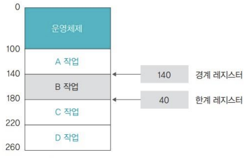
- 메모리를 보호하기 위해 CPU는 현재 진행 중인 작업의 메모리 시작주소를 `경계 레지스터(bound register)`에 저장한 후 작업을 한다.
- 또한 현재 진행 중인 작업이 차지하고 있는 메모리의 크기를 `한계 레지스터(limit register)`에 저장한다.
- 이 두 레지스터의 주소 범위를 벗어나는지 H/W적으로 점검함으로써 메모리를 보호한다.
    - 만약 두 레지스터의 값을 벗어난다면, 메모리 오류와 관련된 `인터럽트`가 발생한다.
        - 모든 작업이 중단되고, CPU는 OS에게 인터럽트를 처리하도록 시키며, OS는 해당 프로그램을 `강제 종료`시킨다.
#### 2.3 부팅
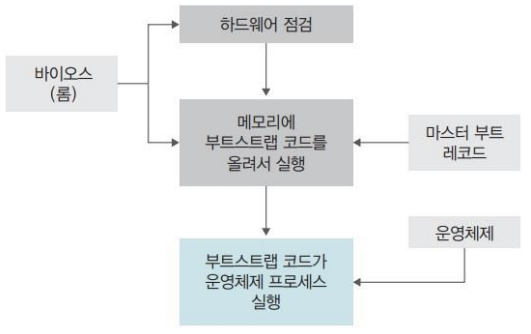
- 컴퓨터를 켰을 때, OS를 메모리에 올리는 과정을 `부팅(booting)`이라 한다.
- <b>부팅 과정</b>
    1. 컴퓨터의 전원을 켜면, `롬`에 저장된 `바이오스`가 실행된다.
    2. `바이오스`는 주요 H/W가 제대로 작동하는지 확인한다.
        - 이상이 있으면 '삐~' 소리와 함께 오류 메시지를 출력한다.
    3. 이상이 없으면 HDD의 `마스터 부트 레코드(Master Boot Record, MBR)`에 저장된 `부트스트랩 코드`를 메모리로 가져와 실행한다.
        - `마스터 부트 레코드`는 HDD의 첫 번째 섹터를 가리킨다.
        - 여기에는 OS를 메모리로 가져와 실행하는 코드인 `부트스트랩(bootstrap)`이 저장되어 있다.
___
## 컴퓨터 성능 향상 기술
- 현대 컴퓨터 구조의 가장 큰 문제는 `CPU와 메모리, 주변장치의 작업 속도가 다르다는 것`이다.
- 이러한 장치 간 속도 차이를 개선하고, 시스템의 작업 속도를 올리기 위해 개발된 기술 중 OS와 관련된 기술을 살펴보자.
### 1. 버퍼
#### 1.1 버퍼의 개념
- <b>버퍼(buffer)</b>
    - 버퍼는 `속도에 차이가 있는 두 장치 사이`에서 그 차이를 완화하는 역할을 한다.
    - `일정량의 데이터를 모아 옮김`으로써 속도의 차이를 완화한다.
    - 프로그램들이 `버퍼를 공유`하며, 버퍼가 가득 차면 데이터 이동이 시작된다.
    > ex)
    > - HDD(H/W) 사양 1TB, 7200rpm, 32MB
    >   - 메모리 버퍼 용량이 32MB, 같은 사양이라면 버퍼 용량이 큰 것이 더 빠름
    > - 동영상 스트리밍(S/W)
    >   - 네트워크에서 데이터가 들어오는 시간과 플레이어가 재생되는 시간의 속도 차이 발생
    >   - 동영상 데이터 일정 부분을 버퍼에 넣은 후 실행
#### 1.2 스풀
- <b>스풀(SPOOL, Simultaneous Peripheral Operation On-Line)</b>
    - `CPU와 입출력장치가 독립적으로 동작`하도록 고안된 `S/W적인 버퍼`이다.
    - 프로그램 간 `배타적`이다.
        > ex) 프린터 스풀러
        > - 인쇄할 내용을 순차적으로 출력하는 S/W으로, 출력 명령을 내린 프로그램과 독립적으로 동작함
        
        > ex) 하드웨어 안전 제거
        > - 버퍼가 아직 가득 차지 않아 옮겨지지 않은 데이터를 저장장치로 보내고, 전원을 차단하여 안전하게 제거할 수 있도록 준비해준다.
### 2. 캐시
#### 2.1 캐시의 개념
- <b>캐시</b>
    - `메모리와 CPU간`의 속도 차이를 완화하기 위해 `메모리의 데이터를 미리 가져와 저장`해두는 임시 장소이다.
    - 캐시는 버퍼의 일종으로, `CPU가 앞으로 사용할 것으로 예상되는 데이터`를 미리 가져다놓는다.
        - 이러한 작업을 `미리 가져오기(prefetch)`라고 한다.
    - 캐시는 CPU 안에 있으며, CPU 내부 버스의 속도로 작동한다.
    - CPU는 메모리에 접근해야 할 때, 캐시를 먼저 방문한다.
        - 원하는 데이터가 캐시에 없으면, 메모리로 가서 데이터를 찾는다. (`캐시 미스(cache miss)`)
        - 캐시에서 원하는 데이터를 찾았다면, 해당 데이터를 사용한다. (`캐시 히트(cache hit)`)
    - 일반 컴퓨터의 `캐시 적중률(cache hit ratio)`은 약 `90%`이다.
    - 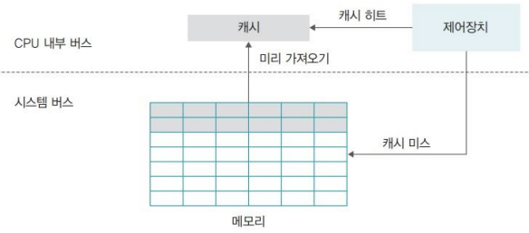
#### 2.2 즉시 쓰기와 지연 쓰기
- 캐시에 있는 데이터가 변경되면, 메모리에 있는 원래 데이터를 변경해야 한다.
- 캐시의 변경된 데이터를 메모리에 반영하는 데에는 `즉시 쓰기 방식`과 `지연 쓰기 방식`이 있다.<br><br>
- <b>즉시 쓰기(write through)</b>
    - 캐시에 있는 데이터가 변경되면, 이를 `즉시 메모리에 반영`하는 방식이다.
    - 빈번한 데이터 전송으로 성능이 느려지지만, 급작스러운 정전에도 데이터를 잃어버리지 않는다.
- <b>지연 쓰기(write back)</b>
    - 캐시에 있는 데이터가 변경되면, 변경된 내용을 모아 `주기적으로 반영`하는 방식으로, `카피백(copy back)`이라고도 한다.
    - 데이터 전송 횟수가 줄어 시스템의 성능을 향상시킬 수 있으나, 메모리와 캐시된 데이터의 불일치가 발생할 수 있다.
#### 2.3 L1 캐시와 L2 캐시
- 프로그램의 명령어는 크게 `명령어 부분`과 `데이터 부분`으로 나눌 수 있다.
- 캐시는 명령어와 데이터 구분 없이 모든 자료를 가져오는 `일반 캐시`와, 명령어와 데이터를 구분하여 가져오는 `특수 캐시`라는 두 가지 레벨로 구분된다.<br><br>
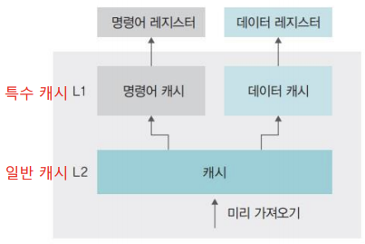
- 명령어 캐시나 데이터 캐시는 CPU 레지스터에 직접 연결되기 때문에 `L1(Level 1) 캐시`라고 부르며, 일반 캐시는 메모리와 연결되기 때문에 `L2(Level 2) 캐시`라고 부른다.
#### 2.4 웹 브라우저 캐시
- S/W적으로 사용되는 캐시로, 앞으로 다시 방문할 것을 예상하여 지우지 않은 데이터라고 정의한다.
- 웹 브라우저 캐시는 방문한 사이트의 데이터를 보관하여, `재방문 시 속도를 높이는 역할`을 한다.
- 그러나, 너무 많은 데이터가 캐시에 보관되어 있으면 웹 브라우저의 속도를 떨어뜨릴 수 있으므로 가끔 청소를 하는 것이 좋다.
### 3. 저장장치의 계층 구조
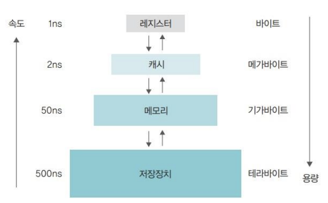
- <b>개념</b>
    - 속도가 빠르고 값이 비싼 저장장치를 CPU 가까운 쪽에 두고, 값이 싸고 용량이 큰 저장장치를 반대쪽에 배치하여 적당한 가격으로 빠른 속도와 큰 용량을 동시에 얻는 방법
- <b>이점</b>
    - CPU와 가까운 쪽에 레지스터나 캐시를 배치하여 CPU가 작업을 빨리 진행할 수 있음
    - 메모리에서 작업한 내용을 하드디스크와 같이 저렴하고 용량이 큰 저장장치에 영구적으로 저장할 수 있음
- <b>문제점</b>
    - 중복되는 데이터의 일관성을 유지하는 것이 문제
        > ex) 캐시의 지연 쓰기, 버퍼를 비우지 않고 H/W를 제거, 분산 데이터베이스, 병렬 컴퓨터의 분산 메모리 등
### 4. 인터럽트
#### 4.1 인터럽트 개념
- <b>폴링(polling)</b>
    - CPU가 직접 입출력장치에서 데이터를 가져오거나 내보내는 방식
    - CPU가 입출력장치의 상태를 주기적으로 검사하여 일정한 조건을 만족할 때 데이터를 처리
    - CPU가 명령어 해석과 실행이라는 본래 역할 외에 모든 입출력까지 관여해야 하므로 작업 효율이 떨어짐
- <b>인터럽트(interrupt) 방식</b>
    - `입출력 관리자가 대신 입출력`을 해주는 방식
    - `CPU의 작업`과 `저장장치의 데이터 이동`을 `독립적`으로 운영함으로써 시스템의 효율을 높임
    - 데이터의 입출력이 이루어지는 동안 CPU가 다른 작업을 할 수 있음<br><br>
    - <b>인터럽트</b>
        - 입출력 관리자가 CPU에게 보내는 완료 신호
    - <b>인터럽트 번호</b>
        - 많은 주변장치 중 `어떤 것의 작업이 끝났는지`를 CPU에 알려주기 위해 사용하는 번호
        - Windows OS에서는 `IRQ`라고 부름
    - <b>인터럽트 벡터</b>
        - 여러 개의 입출력 작업을 한꺼번에 처리하기 위해 `여러 개의 인터럽트를 하나의 배열`로 만든 것
#### 4.2 인터럽트 방식의 동작 과정
- <b>인터럽트 처리 과정</b>
    - 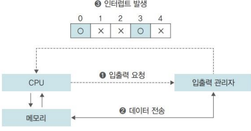
    1. CPU가 입출력 관리자에게 `입출력 명령`을 보낸다.
    2. 입출력 관리자는 명령받은 데이터를 메모리에 가져놓거나, 메모리의 데이터를 저장장치로 옮긴다.
    3. 데이터 전송이 완료되면, 입출력 관리자는 `완료 신호`를 CPU에게 보낸다.
#### 4.3 직접 메모리 접근(Direct Memory Access, DMA)
- 입출력 관리자가 `CPU의 허락 없이 메모리에 접근`할 수 있는 권한
- `메모리는 CPU의 작업 공간`이지만, 데이터 전송을 지시받은 입출력 관리자는 직접 메모리 접근 권한이 있어야만 작업을 처리할 수 있음<br><br>
- <b>직접 메모리 접근 제어기의 구조</b><br>
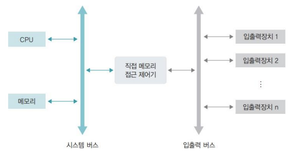
#### 4.4 메모리 매핑 입출력(Memory Mapped I/O, MMIO)
- 메모리의 일정 공간을 입출력에 할당하는 기법<br>
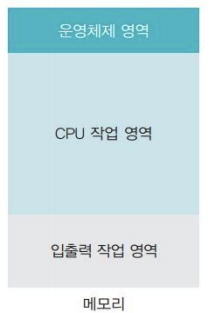
#### 4.5 사이클 훔치기
- CPU와 직접 메모리 접근이 동시에 메모리에 접근하면, 보통 `CPU가 메모리 사용 권한을 양보`함
- CPU의 작업 속도보다 `입출력장치의 속도가 느리기 때문`에, 직접 메모리 접근에 양보하는 것으로, 이러한 상황을 사이클 훔치기라고 한다.
___
## 병렬 처리
- `CPU의 성능을 향상`하는 가장 좋은 방법은 다음과 같다.
    1. <b>CPU의 클록을 높인다.</b>
        - 발열 문제로 현재 기술로는 5GHz가 넘는 CPU 개발은 힘듦
    2. <b>캐시의 크기를 늘린다.</b>
        - 비용이 매우 비쌈
    3. <b>CPU의 핵심 기능을 가진 코어를 여러 개 만든다.</b>
    4. <b>동시에 실행 가능한 명령의 개수를 늘린다.</b>
### 1. 병렬 처리의 개념
- <b>병렬 처리(parallel processing)</b>
    - `동시에 여러 개의 명령을 처리`하여 작업의 능률을 올리는 방식
    - CPU의 코어 개수에 상관 없이 병렬 처리 가능
### 2. 병렬 처리 시 고려 사항
- <b>상호 의존성이 없어야 병렬 처리가 가능</b>
    - 각 명령이 서로 독립적이고, 앞의 결과가 뒤의 명령에 영향을 미치지 않아야 함
- <b>각 단계의 시간을 일정하게 맞춰야 병렬 처리가 원만하게 이루어 짐</b>
    - 오랜 시간이 걸리는 작업 때문에 진행이 전반적으로 밀려서 전체 작업 시간이 늘어나므로, 단계별 시간의 차이가 크면 병렬 처리의 효과가 떨어짐
- <b>전체 작업 시간을 몇 단계로 나눌지 잘 따져보아야 함</b>
    - `병렬 처리 깊이 N`: 동시에 처리할 수 있는 작업의 개수
    - 이론적으로는 N이 클수록 동시에 처리할 수 있는 작업의 개수가 많아져 성능이 높아지지만, 작업을 너무 많이 나누면 각 단계마다 작업을 이동하고, 새로운 작업을 불러오눈 데 시간이 너무 많이 걸려서 오히려 성능이 떨어짐
### 3. 병렬 처리 기법
- <b>CPU에서 명령어가 실행되는 과정</b>
    1. <b>명령어 패치(Instruction Fetch, `IF`)</b>: 다음에 실행할 명령어를 명령어 레지스터에 저장
    2. <b>명령어 해석(Instruction Decode, `ID`)</b>
    3. <b>실행(EXecution, `EX`)</b>
    4. <b>쓰기(Write Back, `WB`)</b>: 실행 결과를 메모리에 저장
- <b>파이프라인(pipeline) 기법</b>
    - CPU의 사용을 극대화하기 위해 `명령을 겹쳐 실행`하는 방법
    - 파이프라인 기법을 인텔 계열의 CPU에서는 `하이퍼스레드`라고 부른다.
        > CPU에 여러 개의 작업을 동시에 진행할 수 있는 부가장치를 만들어, 하나의 코어에서도 여러 개의 작업(스레드)이 동시에 이루어지게 하는 기법
    - <b>파이프라인 기법의 동작 과정</b>
        - 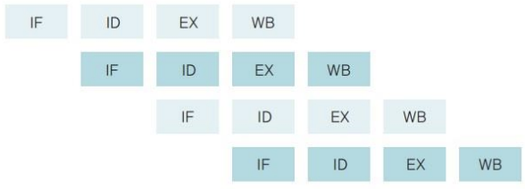
    - <b>파이프라인의 위험</b>
        - <b>데이터 위험(data hazard)</b>
            - `데이터의 의존성` 때문에 발생하는 문제
            - 데이터 A를 필요로 하는 두 번째 명령어는 앞의 명령어가 끝날 때까지 동시에 실행되어서는 안 됨
            - 데이터 위험은 파이프라인의 명령어 단계를 지연하여 해결
            - 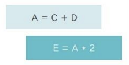
        - <b>제어 위험(control hazard)</b>
            - `프로그램 카운터 값을 갑자기 변화`시켜 발생하는 위험
            - 첫 명령어를 실행하고 보니 goto 문이어서 다음 문장이 아닌, 다른 문장으로 이동하면 현재 동시에 처리되고 있는 명령어들이 쓸모없어짐
            - 제어 위험은 분기 예측이나 분기 지연 방법으로 해결
            - 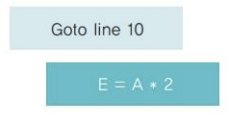
        - <b>구조 위험(structural hazard)</b>
            - `서로 다른 명령어가 같은 자원에 접근`하려 할 때 발생하는 문제
            - 명령어 A가 레지스터 RX를 사용하고 있는데, 병렬 처리되는 명령어 B도 레지스터 RX를 사용해야 한다면 서로 충돌
            - 구조 위험은 해결하기 어렵다고 알려져 있음
            - 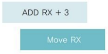
- <b>슈퍼스칼라(super-scalar) 기법</b>
    - 파이프라인을 처리할 수 있는 `코어를 여러 개 구성`하여 `복수의 명령어가 동시에 실행`되도록 하는 방식
    - 대부분은 파이프라인 기법과 동일하지만, 코어를 여러 개 구성하여 `각 단계에서 동시에 실행되는 명령어가 여러 개라`는 점이 다름
    - <b>슈퍼스칼라 기법의 동작 과정</b>
        - 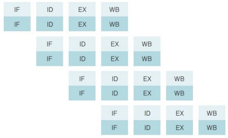
- <b>슈퍼파이프라인 기법</b>
    - `파이프라인의 각 단계를 세분화`하여 `한 클록 내에 여러 명령어를 처리`
    - 한 클록 내에 여러 명령어를 실행하면, 다음 명령어가 빠른 시간 안에 시작될 수 있어 병렬 처리 능력이 높아짐
    - <b>슈퍼파이프라인 기법의 동작 과정</b>
        - 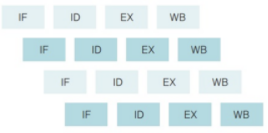
- <b>슈퍼파이프라인 슈퍼스칼라 기법</b>
    - `슈퍼파이프라인 기법을 여러 개의 코어에서 동시에 수행`하는 방식
    - <b>슈퍼파이프라인 슈퍼스칼라 기법의 동작 과정</b>
        - 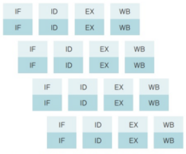
- <b>VLIW(Very Long Instruction Word) 기법</b>
    - CPU가 병렬 처리를 지원하지 않을 경우, `S/W적으로 병렬 처리`를 하는 방법
    - `동시에 수행할 수 있는 명령어들을 컴파일러가 추출하고, 하나의 명령어로 압축하여 실행`
    - 앞의 병렬 처리 기법들에 비해 동시에 처리하는 명령어의 개수가 적음
    - `컴파일 시 병렬 처리`가 이루어짐